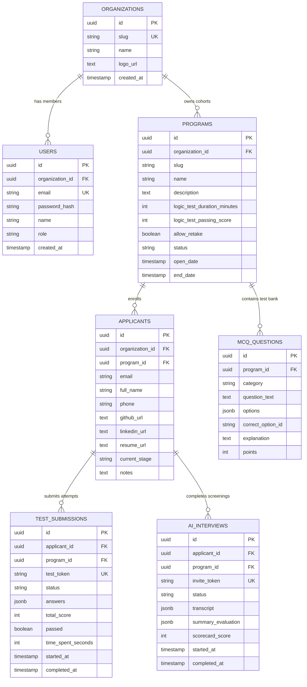

# FellowHire: Data Modelling, Architecture & CI/CD Deployment Guide

This document responds directly to the architectural guidance and feedback from Kulkul Tech for **FellowHire / Assessment Platform**.

---

## 1. Scaffolding & Data Modelling

### 1.1 Architecture & Multi-Tenant Hierarchy
The platform implements strict multi-tenancy where data is partitioned by `organization_id`:

```
Organization (e.g. Remote Skills Academy / RSA)
 ├── Users (Reviewer Admins, Evaluators)
 └── Programs (e.g. LIT 2026 Fellowship, Cloud 2026)
      ├── MCQ Question Bank (Category, Options, Correct Answer, Points)
      └── Applicants (Intake Profile, CV, Current Stage)
           ├── Test Submissions (Started, Completed, Answers, Score, Passed)
           └── AI Interviews (Transcript, Evaluation Summary, Scorecard)
```

### 1.2 Database Entity-Relationship Diagram (PostgreSQL)



### 1.3 SQL Migrations
All migrations are located in [`apps/backend/migrations/00001_initial_schema.sql`](apps/backend/migrations/00001_initial_schema.sql) and managed via Goose.

---

## 2. Automated CI/CD & Server Deployment

A production-ready GitHub Actions workflow is configured in [`.github/workflows/ci-cd.yml`](.github/workflows/ci-cd.yml):

1. **On Push / PR (`main`, `develop`)**:
   - **Backend Matrix**: Go `1.25`, `go vet ./...`, `go test -v ./...`, and binary compilation.
   - **Frontend Matrix**: Node `22`, TypeScript check (`tsc -b`), and Vite production bundle.
2. **Container Build & Registry**:
   - Multi-stage Go runtime container ([`apps/backend/Dockerfile`](apps/backend/Dockerfile)).
   - Nginx SPA runtime container ([`apps/frontend/Dockerfile`](apps/frontend/Dockerfile) + [`apps/frontend/nginx.conf`](apps/frontend/nginx.conf)).
   - Automatically pushed to GitHub Container Registry (`ghcr.io`).
3. **Automated Live Deployment**:
   - Triggered on push to `main` to deploy the latest container image tags to Kulkul server / Google Cloud Run.

---

## 3. Plumbing ⚙️ & Credentials Needed from Kulkul

To connect the live services into Kulkul's cloud infrastructure without using personal accounts, here is the exact list of credentials / accesses requested:

| Component | Required Key / Credential | Purpose |
|---|---|---|
| **Google OAuth 2.0** | `GOOGLE_CLIENT_ID`<br>`GOOGLE_CLIENT_SECRET` | Google Sign-In for Reviewer Admins & Evaluators. |
| **OAuth Callback URL** | `http://<kulkul-domain>/api/v1/auth/oauth/google/callback` | Authorized redirect URI in GCP OAuth Consent Screen. |
| **AI Screening** | `GEMINI_API_KEY` or `OPENAI_API_KEY` | Real-time conversational interview evaluation and automated scorecard grading. |
| **Database** | `DATABASE_URL` (PostgreSQL 16) | Managed cloud PostgreSQL instance connection string. |
| **Google Secret Manager** | GCP Service Account Key (`GCP_SA_KEY`) or Workload Identity | To pull production secrets securely into Cloud Run / server. |

---

## 4. Secret Management Strategy (Google Secret Manager)

- **Local Development**: Configured via `.env` files with safe development defaults and in-memory fallback state so the app runs standalone without external dependencies.
- **Staging / Production (Kulkul Server)**:
  - Secrets injected directly from **Google Secret Manager** (GSM) via GCP Secret Environment variables or Cloud Run secret mounts:
    ```bash
    gcloud run services update fellowhire-backend \
      --set-secrets=DATABASE_URL=fellowhire-db-url:latest,\
                    JWT_SECRET=fellowhire-jwt-secret:latest,\
                    GOOGLE_CLIENT_ID=fellowhire-google-client-id:latest,\
                    GOOGLE_CLIENT_SECRET=fellowhire-google-client-secret:latest,\
                    GEMINI_API_KEY=fellowhire-gemini-key:latest
    ```

---

## 5. Daily Iterative Checkpoint & Progress Log

- [x] **Day 1: Monorepo & Backend Core**: Turborepo, Chi router, JWT double-submit CSRF cookie auth, Goose SQL migration schema.
- [x] **Day 2: Assessment Funnel & AI Screening**: Timed logic MCQ engine, candidate intake, auto-graded scorecards, conversational AI screening room, and reviewer dashboard.
- [x] **Day 3: Google Stitch / Kulkul Aesthetic**: Flowmingo-inspired landing page, Google Stitch tokens (`#fe900d`, `#33125d`), pop-up `AuthModal`, configurable benchmarks (passing grade %, test duration), and 1-attempt integrity rules.
- [x] **Day 4: Google OAuth & CI/CD Pipeline**: Google OAuth 2.0 implementation, Dockerfiles, and `.github/workflows/ci-cd.yml` push-to-deploy workflow.
- [ ] **Next Steps**: Plug in Kulkul GCP Google Secret Manager secrets, Cloud Run deployment trigger, and live DNS mapping.
